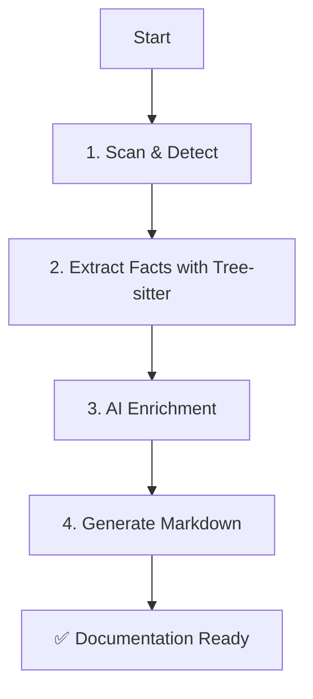

# 🏗️ Architecture Documentation

> Modern and clear documentation of the automatic documentation generator

## 📋 Table of Contents

1. [Overview](#overview)
2. [Why it Works](#why-it-works)
3. [System Architecture](#system-architecture)
4. [Processing Flow](#processing-flow)
5. [Detailed Components](#detailed-components)
6. [Data Formats](#data-formats)
7. [Extensions and Customization](#extensions-and-customization)
8. [Deployment](#deployment)

---

## 🎯 Overview

### What is it?

An intelligent Python tool that **automatically analyzes legacy code** (Struts, PHP, Spring Boot) and **generates comprehensive technical documentation** using Anthropic's Claude AI.

### Problem Solved

Legacy projects often lack documentation. Manual analysis takes days. This generator automates:
- ✅ **Detection** of the framework used
- ✅ **Extraction** of the structure (endpoints, SQL queries, etc.)
- ✅ **Analysis** of security vulnerabilities
- ✅ **Enrichment** with AI to understand business logic
- ✅ **Generation** of a complete README.md

### Benefits

| Before | After |
|-------|-------|
| 3-5 days of manual analysis | 2 minutes automatic |
| Incomplete documentation | Full structure with evidence |
| Ignored security risks | Automatic detection |
| No overview | AI diagrams and summaries |

---

## 💡 Why it Works

### Fundamental Principle: Processing Pipeline

```
Legacy Code → Detection → Extraction → AI Enrichment → Documentation
```

### 1. Intelligent Detection by Scoring

Instead of asking the user which framework they use, we **automatically detect** it:

```python
# Example: Struts Detection
score = 0.0
if "struts-config.xml" exists: score += 0.5
if "extends Action" in code: score += 0.3
# → Confidence: 0.8 (80%) = STRUTS
```

**Why it works?**
- Each framework has **unique markers** (files, patterns)
- Scoring handles **mixed frameworks**
- The highest score wins

### 2. Pattern-based Extraction (Tree-sitter & Regex)

We use **Tree-sitter** for precise symbol extraction and **targeted regex** for specific patterns:

```python
# Example: Spring endpoint extraction
@GetMapping("/users") → GET /users endpoint
@PostMapping("/login") → POST /login endpoint
```

**Why it works?**
- Frameworks have **strict conventions**
- Tree-sitter provides reliable AST-based extraction
- Regex covers 90% of specific edge cases simply

### 3. Security Detection by Pattern Matching

```php
// Detected pattern: SQL Injection
mysql_query("SELECT * FROM users WHERE id = " . $_GET['id'])
# → ⚠️ HIGH: User variable in SQL query
```

**Why it works?**
- Common vulnerabilities have **known signatures**
- Better safe than sorry approach

### 4. Contextual AI Enrichment

We send only a **structured summary** to the LLM:

```
Endpoints found: POST /login, GET /users, ...
SQL Queries: 15 SELECT, 5 INSERT, ...
Framework: Struts (80% confidence)

→ Claude analyzes and responds:
"This application manages user authentication and..."
```

**Why it works?**
- You only pay for analysis, not for raw text extraction
- AI understands technical context
- Minimal cost (~$0.01 per project)

---

## 🏛️ System Architecture

### Overview

```
┌─────────────────────────────────────────────────┐
│                 generate_docs.py                │
│                 (Main Script)                   │
└────────┬────────────────────────────────────────┘
         │
         ├─→ CacheManager        # Results caching
         ├─→ Tree-sitter Parsers # Symbol extraction
         ├─→ LLMClient           # AI Enrichment (Anthropic/OpenAI/Ollama)
         └─→ Markdown Generators # Final output
```

### 4-Layer Architecture

```
┌──────────────────────────────────────────────────┐
│  LAYER 1: SCANNING                               │
│  File system traversal                           │
│  → Ignore irrelevant dirs                        │
│  → Output: List of relevant files                │
└──────────────────────────────────────────────────┘
                     ▼
┌──────────────────────────────────────────────────┐
│  LAYER 2: EXTRACTION (Tree-sitter)               │
│  Code parsing                                    │
│  → Classes, functions, routes, SQL               │
│  → Output: doc_context.json                      │
└──────────────────────────────────────────────────┘
                     ▼
┌──────────────────────────────────────────────────┐
│  LAYER 3: ENRICHMENT (AI)                        │
│  LLM processing                                  │
│  → Send facts, get descriptions                  │
│  → Output: Enhanced context                      │
└──────────────────────────────────────────────────┘
                     ▼
┌──────────────────────────────────────────────────┐
│  LAYER 4: GENERATION                             │
│  Markdown formatting                             │
│  → Template engine                               │
│  → Output: README.md, architecture.md, etc.      │
└──────────────────────────────────────────────────┘
```

---

## 🔄 Processing Flow

### Complete 4-Step Flow



---

## 🧩 Detailed Components

### 1. CacheManager
Handles caching of parsing results to speed up repeated runs on large repositories.

### 2. LLMClient
A unified interface supporting:
- **Anthropic**: Claude 3.5 Sonnet (Recommended)
- **OpenAI**: GPT-4o
- **Ollama**: Local models (Llama 3.2)

---

## 🚀 Deployment

### Local Usage

```bash
pip install -r requirements.txt
export ANTHROPIC_API_KEY="sk-ant-..."
python3 generate_docs.py --repo /path/to/code
```

### CI/CD Integration

The tool is designed to run in GitLab CI or GitHub Actions, producing documentation artifacts automatically on every push.

---

## 📚 Resources

- **Source Code**: `generate_docs.py`
- **Usage Guide**: `USAGE.md`
- **Anthropic API**: https://docs.anthropic.com/

---

**Architecture designed to be simple, fast, and effective. Ready to use! 🚀**
