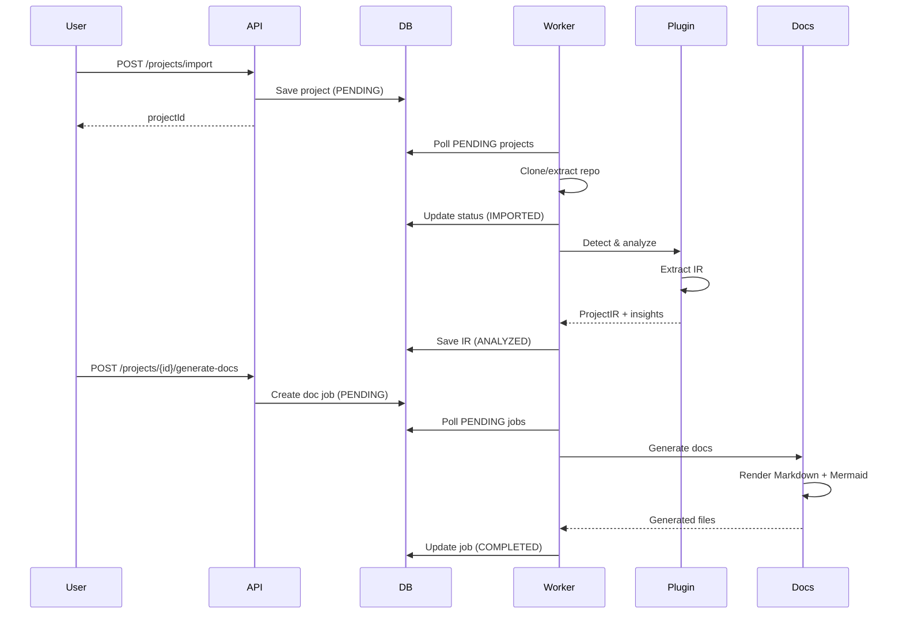

# Architecture Documentation

## Vue d'ensemble

Universal Doc Generator suit une architecture **multi-modules** avec séparation claire des responsabilités.

## Modules

### apps/api
**Responsabilité**: API REST publique

- Endpoints HTTP pour import/status/generation
- Controllers Spring Boot
- Validation des requêtes
- Actuator pour monitoring

**Dépendances**: Toutes les libs

### apps/worker
**Responsabilité**: Traitement asynchrone

- Polling de jobs en base
- Import de repos (Git/ZIP)
- Analyse via plugins
- Génération de documentation

**Dépendances**: Toutes les libs

### libs/core
**Responsabilité**: Modèle de domaine

- IR (Intermediate Representation) normalisé
- Entités JPA
- Repositories
- Value objects (Evidence, Assertion, Confidence)

**Dépendances**: Aucune (sauf Spring Data JPA)

### libs/parsing
**Responsabilité**: Extraction de code

- Détection de technologies (fingerprinting)
- Extracteurs de symboles (regex, Tree-sitter)
- Comptage LOC/fichiers

**Dépendances**: libs/core

### libs/plugins
**Responsabilité**: Système de plugins

- API plugin
- Registry
- Plugins built-in: Node, Python, Java/Spring

**Dépendances**: libs/core, libs/parsing

### libs/llm
**Responsabilité**: Intégration LLM (optionnel)

- Interface `LLMClient`
- Mock implementation (fallback)
- Schemas pour structured output

**Dépendances**: libs/core

### libs/docs
**Responsabilité**: Génération documentation

- Rendu Markdown
- Génération diagrammes Mermaid
- Templates
- Configuration MkDocs

**Dépendances**: libs/core

## Flux de données



## Modèle IR (Intermediate Representation)

L'IR est le cœur de l'architecture. Il normalise toutes les technologies vers un modèle commun:

```
ProjectIR
├── modules: List<ModuleIR>
│   ├── services: List<ServiceIR>
│   ├── endpoints: List<EndpointIR>
│   ├── entities: List<EntityIR>
│   ├── jobs: List<JobIR>
│   └── events: List<EventIR>
├── dependencies: List<DependencyIR>
└── fingerprint: ProjectFingerprint
```

Chaque élément contient:
- Identifiant stable
- Métadonnées
- **Evidences** (preuves dans le code source)

## Plugin System

Les plugins implémentent `AnalysisPlugin`:

```kotlin
interface AnalysisPlugin {
    val name: String
    fun detect(fingerprint: ProjectFingerprint, projectPath: Path): Double
    fun analyze(projectPath: Path): PluginAnalysisResult
    fun functionalRules(): List<FunctionalRule>
}
```

### Flow d'analyse

1. **Detection**: Chaque plugin retourne un score de confiance
2. **Selection**: Le plugin avec le meilleur score est choisi
3. **Analysis**: Le plugin extrait l'IR du projet
4. **Persistence**: L'IR est sauvegardé en base

## Evidence-Based Design

Principe: **toute assertion = preuve**

```kotlin
data class Evidence(
    val filePath: String,
    val startLine: Int,
    val endLine: Int?,
    val symbol: String?,
    val snippet: String?
)

data class Assertion<T>(
    val value: T,
    val confidence: Confidence,
    val evidences: List<Evidence>,
    val uncertainties: List<String>
)
```

Niveaux de confiance:
- `CERTAIN`: preuve directe dans le code
- `PROBABLE`: déduction forte (tests, docs)
- `HYPOTHESE`: inférence faible
- `INCERTAIN`: pas de preuve

## Base de données

### Schema principal

```sql
projects
  ├─ modules
  │   └─ code_symbols
  │       └─ code_relations (graph)
  ├─ dependencies
  ├─ evidences
  └─ documentation_jobs
```

### pgvector

Table `code_embeddings` pour recherche sémantique (future):
- Embeddings de symboles
- Index HNSW pour ANN search

## Scalabilité

### Current (MVP)
- Polling simple (scheduled tasks)
- Single instance

### Future
- Job queue (RabbitMQ/SQS)
- Multi-instance workers
- Distributed processing
- Cache (Redis)

## Sécurité

1. **Secrets detection**: Pattern matching avant sortie
2. **Sandboxing**: Pas d'exécution de code
3. **Size limits**: Max 1GB par projet
4. **Local-first**: Pas d'envoi réseau par défaut

## Observabilité

- **Logs structurés** (JSON)
- **Metrics** (Micrometer + Prometheus)
- **Health checks** (Actuator)
- **Tracing** (future: OpenTelemetry)

## Décisions d'architecture (ADR)

### ADR-001: Monorepo Gradle
**Contexte**: Plusieurs modules interdépendants
**Décision**: Monorepo Gradle multi-modules
**Conséquence**: Build unifié, versioning cohérent

### ADR-002: IR Normalisé
**Contexte**: Multi-technologies
**Décision**: Modèle IR agnostique
**Conséquence**: Plugins produisent tous le même format

### ADR-003: Evidence-Based
**Contexte**: Confiance dans la documentation
**Décision**: Toute assertion doit pointer vers une preuve
**Conséquence**: Plus verbeux mais vérifiable

### ADR-004: Mock LLM par défaut
**Contexte**: LLM coûteux et optionnel
**Décision**: Mock par défaut, LLM en option
**Conséquence**: Application fonctionnelle sans LLM

### ADR-005: PostgreSQL + pgvector
**Contexte**: Graph + embeddings + relations
**Décision**: Postgres avec pgvector (vs Neo4j)
**Conséquence**: Une seule DB, plus simple à déployer
