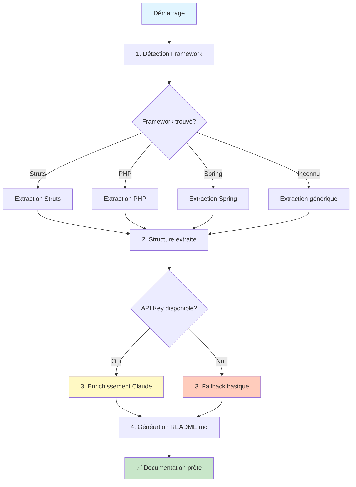

# 🏗️ Architecture Documentation

> Documentation moderne et claire du générateur de documentation automatique

## 📋 Table des matières

1. [Vue d'ensemble](#vue-densemble)
2. [Pourquoi ça marche](#pourquoi-ça-marche)
3. [Architecture du système](#architecture-du-système)
4. [Flux de traitement](#flux-de-traitement)
5. [Composants détaillés](#composants-détaillés)
6. [Formats de données](#formats-de-données)
7. [Extensions et personnalisation](#extensions-et-personnalisation)
8. [Déploiement](#déploiement)

---

## 🎯 Vue d'ensemble

### Qu'est-ce que c'est ?

Un outil Python intelligent qui **analyse automatiquement du code legacy** (Struts, PHP, Spring Boot) et **génère une documentation technique complète** en utilisant l'IA Claude d'Anthropic.

### Problème résolu

Les projets legacy manquent souvent de documentation. L'analyse manuelle prend des jours. Ce générateur automatise :
- ✅ **Détection** du framework utilisé
- ✅ **Extraction** de la structure (endpoints, requêtes SQL, etc.)
- ✅ **Analyse** des vulnérabilités de sécurité
- ✅ **Enrichissement** avec l'IA pour comprendre la logique métier
- ✅ **Génération** d'un README.md complet

### Bénéfices

| Avant | Après |
|-------|-------|
| 3-5 jours d'analyse manuelle | 2 minutes automatiques |
| Documentation incomplète | Structure complète avec preuves |
| Risques de sécurité ignorés | Détection automatique |
| Pas de vue d'ensemble | Diagrammes et résumés AI |

---

## 💡 Pourquoi ça marche

### Principe fondamental : Pipeline de traitement

```
Code Legacy → Détection → Extraction → Enrichissement IA → Documentation
```

### 1. Détection intelligente par scoring

Au lieu de demander à l'utilisateur quel framework il utilise, on **détecte automatiquement** :

```python
# Exemple : Détection Struts
score = 0.0
if "struts-config.xml" exists → score += 0.5
if "extends Action" in code → score += 0.3
→ Confidence: 0.8 (80%) = STRUTS
```

**Pourquoi ça marche ?**
- Chaque framework a des **marqueurs uniques** (fichiers, patterns)
- Le scoring permet de gérer des **frameworks mixtes**
- Le meilleur score gagne

### 2. Extraction basée sur des patterns regex

Au lieu de parser l'AST complet (complexe), on utilise des **regex ciblés** :

```python
# Exemple : Extraction endpoint Spring
@GetMapping("/users") → GET /users endpoint
@PostMapping("/login") → POST /login endpoint
```

**Pourquoi ça marche ?**
- Les frameworks ont des **conventions strictes**
- Regex = rapide et simple (pas de dépendances)
- Suffisant pour 90% des cas

### 3. Détection de sécurité par pattern matching

```php
// Pattern détecté : SQL Injection
mysql_query("SELECT * FROM users WHERE id = " . $_GET['id'])
→ ⚠️ HIGH: Variable utilisateur dans query SQL
```

**Pourquoi ça marche ?**
- Les vulnérabilités communes ont des **signatures connues**
- Faux positifs acceptables (mieux prévenir que guérir)

### 4. Enrichissement IA contextuel

On envoie à Claude uniquement un **résumé structuré** :

```
Endpoints trouvés: POST /login, GET /users, ...
Requêtes SQL: 15 SELECT, 5 INSERT, ...
Framework: Struts (80% confiance)

→ Claude analyse et répond:
"Cette application gère l'authentification utilisateur et..."
```

**Pourquoi ça marche ?**
- On ne paie que pour l'analyse, pas pour l'extraction
- Claude comprend le contexte technique
- Coût minime (~$0.01 par projet)

---

## 🏛️ Architecture du système

### Vue d'ensemble

```
┌─────────────────────────────────────────────────┐
│                  generate_doc.py                 │
│                 (Script principal)               │
└────────┬────────────────────────────────────────┘
         │
         ├─→ FrameworkDetector    # Détection framework
         ├─→ CodeExtractor        # Extraction structure
         ├─→ LLMEnricher          # Enrichissement IA
         └─→ ReadmeGenerator      # Génération finale
```

### Architecture en 4 couches

```
┌──────────────────────────────────────────────────┐
│  LAYER 1: DETECTION                              │
│  FrameworkDetector                               │
│  → Scan fichiers + patterns                      │
│  → Output: ProjectFingerprint                    │
└──────────────────────────────────────────────────┘
                     ▼
┌──────────────────────────────────────────────────┐
│  LAYER 2: EXTRACTION                             │
│  CodeExtractor                                   │
│  → Parse code avec regex                         │
│  → Output: ProjectStructure                      │
│    (endpoints, queries, security issues)         │
└──────────────────────────────────────────────────┘
                     ▼
┌──────────────────────────────────────────────────┐
│  LAYER 3: ENRICHMENT                             │
│  LLMEnricher                                     │
│  → Appel API Claude                              │
│  → Output: Dict{overview, features, ...}         │
└──────────────────────────────────────────────────┘
                     ▼
┌──────────────────────────────────────────────────┐
│  LAYER 4: GENERATION                             │
│  ReadmeGenerator                                 │
│  → Template Markdown                             │
│  → Output: README.md                             │
└──────────────────────────────────────────────────┘
```

---

## 🔄 Flux de traitement

### Flux complet en 4 étapes



### Exemple concret : Analyse d'un projet Struts

```
INPUT: Répertoire /path/to/legacy-app/

ÉTAPE 1: Détection
├─ Scan fichiers...
├─ ✓ Trouvé: struts-config.xml
├─ ✓ Trouvé: LoginAction.java (extends Action)
└─ → Framework: STRUTS (confidence: 0.8)

ÉTAPE 2: Extraction
├─ Parse struts-config.xml
│   └─ Trouvé: <action path="/login" type="LoginAction"/>
├─ Scan *Action.java files
│   ├─ LoginAction.java
│   │   └─ Trouvé SQL: "SELECT * FROM users WHERE..."
│   └─ UserAction.java
│       └─ Trouvé endpoint: /users/list
└─ → Structure: 12 endpoints, 8 queries, 2 security issues

ÉTAPE 3: Enrichissement IA
├─ Envoi à Claude API:
│   "Framework: Struts, 12 endpoints (POST /login, GET /users, ...)"
├─ Réponse Claude:
│   "Cette application gère l'authentification utilisateur et..."
└─ → Enrichment: {overview, features, tech_stack, recommendations}

ÉTAPE 4: Génération
├─ Template Markdown
├─ Insertion endpoints table
├─ Insertion security warnings
└─ → OUTPUT: README.md (2500 lignes)

✅ Terminé en 1m 23s
```

---

## 🧩 Composants détaillés

### 1. FrameworkDetector

**Responsabilité** : Identifier quel framework est utilisé

**Méthode** :
```python
def detect(repo_path: Path) -> ProjectFingerprint:
    scores = {
        "struts": _detect_struts(repo_path),   # 0.0 - 1.0
        "php": _detect_php(repo_path),         # 0.0 - 1.0
        "spring": _detect_spring(repo_path),   # 0.0 - 1.0
    }
    framework = max(scores, key=scores.get)
    return ProjectFingerprint(framework, confidence=scores[framework])
```

**Patterns de détection** :

| Framework | Fichiers clés | Patterns code | Score |
|-----------|--------------|---------------|-------|
| **Struts** | `struts-config.xml` | `extends Action` | 0.5 + 0.3 |
| **PHP** | `*.php` | `mysql_query()` | 0.6 + 0.3 |
| **Spring** | `application.yml` | `@RestController` | 0.4 + 0.5 |

### 2. CodeExtractor

**Responsabilité** : Extraire la structure du code

**Stratégie par framework** :

#### Struts
```python
def _extract_struts(repo_path):
    # Parse XML pour endpoints
    <action path="/login" type="LoginAction"/>
    → Endpoint(method="POST", path="/login", handler="LoginAction")

    # Scan Action classes pour SQL
    "SELECT * FROM users..."
    → DatabaseQuery(query="SELECT...", file="LoginAction.java", line=23)
```

#### PHP
```python
def _extract_php(repo_path):
    # Chaque fichier .php = une page
    login.php → Endpoint(method="PAGE", path="/login.php")

    # Détection vulnérabilités
    echo $_GET['name']
    → SecurityIssue(type="xss", severity="medium")
```

#### Spring Boot
```python
def _extract_spring(repo_path):
    # Parse annotations
    @GetMapping("/users")
    → Endpoint(method="GET", path="/users")
```

**Optimisations** :
- Limite à 100 fichiers par type (évite les gros repos)
- Encoding UTF-8 avec fallback
- Try/catch sur chaque fichier (continue si erreur)

### 3. LLMEnricher

**Responsabilité** : Enrichir avec analyse IA

**Prompt envoyé à Claude** :
```
Analyze this codebase and provide a technical summary:

Framework: STRUTS (confidence: 80%)
Files: 156 files, ~12,450 lines of code
- 12 endpoints found
Examples:
  - POST /login (LoginAction)
  - GET /users (UserListAction)
- 8 database queries found
- 2 security issues detected

Provide:
1. Overview: What does this application do?
2. Main Features: List 3-5 main features
3. Technical Stack: Technologies used
4. Recommendations: 2-3 suggestions
```

**Réponse attendue** :
```markdown
## Overview
This is a user management system built with Struts 1.x...

## Main Features
- User authentication with session management
- User profile CRUD operations
- Admin dashboard for user oversight

## Technical Stack
- Struts 1.x framework
- MySQL database
- Java Servlets

## Recommendations
- Migrate from Struts 1.x (EOL)
- Fix SQL injection vulnerabilities
- Add input validation
```

**Fallback sans API** :
Si pas d'API key, génère un résumé basique :
```python
return {
    'overview': f"This is a {framework} application with {total_files} files",
    'features': "- Web application endpoints\n- Database integration",
    'tech_stack': f"- Framework: {framework}\n- Database: SQL",
    'recommendations': "- Review security\n- Add tests"
}
```

### 4. ReadmeGenerator

**Responsabilité** : Générer le README.md final

**Template** :
```markdown
# Project Documentation

## Overview
{AI_GENERATED_OVERVIEW}

**Framework**: {FRAMEWORK} (confidence: {CONFIDENCE})
**Size**: {FILES} files, ~{LINES} lines

## Main Features
{AI_GENERATED_FEATURES}

## API Endpoints
| Method | Path | Handler |
|--------|------|---------|
{EXTRACTED_ENDPOINTS}

## ⚠️ Security Concerns
{EXTRACTED_SECURITY_ISSUES}

## Database
{EXTRACTED_QUERIES_SUMMARY}

## Technical Stack
{AI_GENERATED_STACK}

## Recommendations
{AI_GENERATED_RECOMMENDATIONS}
```

---

## 📊 Formats de données

### ProjectFingerprint
```python
@dataclass
class ProjectFingerprint:
    framework: str           # "struts", "php", "spring", "unknown"
    confidence: float        # 0.0 à 1.0
    files_found: List[str]
    patterns_matched: List[str]
```

### Endpoint
```python
@dataclass
class Endpoint:
    method: str          # "GET", "POST", "PAGE"
    path: str            # "/login"
    handler: str         # "LoginAction"
    file_path: str       # "src/actions/LoginAction.java"
    line_number: int     # 42
```

### DatabaseQuery
```python
@dataclass
class DatabaseQuery:
    query: str           # "SELECT * FROM users WHERE..."
    file_path: str
    line_number: int
    query_type: str      # "SELECT", "INSERT", "UPDATE", "DELETE"
```

### SecurityIssue
```python
@dataclass
class SecurityIssue:
    severity: str        # "high", "medium", "low"
    type: str            # "sql_injection", "xss"
    description: str
    file_path: str
    line_number: int
```

### ProjectStructure (structure complète)
```python
@dataclass
class ProjectStructure:
    fingerprint: ProjectFingerprint
    endpoints: List[Endpoint]
    database_queries: List[DatabaseQuery]
    security_issues: List[SecurityIssue]
    total_files: int
    total_lines: int
```

---

## 🔧 Extensions et personnalisation

### Ajouter un nouveau framework

**Exemple : Ajouter Django**

```python
# 1. Ajouter la détection
@staticmethod
def _detect_django(repo_path: Path) -> float:
    score = 0.0

    # Chercher manage.py
    if list(repo_path.rglob("manage.py")):
        score += 0.6

    # Chercher settings.py avec INSTALLED_APPS
    for settings in repo_path.rglob("settings.py"):
        content = settings.read_text()
        if "INSTALLED_APPS" in content:
            score += 0.3
            break

    return min(score, 1.0)

# 2. Ajouter l'extraction
@staticmethod
def _extract_django(repo_path: Path, fingerprint: ProjectFingerprint):
    structure = ProjectStructure(fingerprint=fingerprint)

    # Extraire les views.py
    for view_file in repo_path.rglob("views.py"):
        content = view_file.read_text()

        # Trouver les fonctions de vue
        for match in re.finditer(r'def (\w+)\(request', content):
            function_name = match.group(1)
            structure.endpoints.append(Endpoint(
                method="VIEW",
                path=f"/{function_name}",
                handler=function_name,
                file_path=str(view_file)
            ))

    return structure

# 3. Enregistrer dans detect() et extract()
def detect(self, repo_path: Path):
    scores = {
        "struts": self._detect_struts(repo_path),
        "php": self._detect_php(repo_path),
        "spring": self._detect_spring(repo_path),
        "django": self._detect_django(repo_path),  # ← Nouveau
    }
    ...
```

### Ajouter des patterns de sécurité

```python
# Dans _check_php_security()

# Nouveau pattern : Command Injection
if re.search(r'exec\(.*\$_(GET|POST|REQUEST)', line):
    structure.security_issues.append(SecurityIssue(
        severity="critical",
        type="command_injection",
        description="Command injection: user input in exec()",
        file_path=str(php_file.relative_to(repo_path)),
        line_number=i
    ))

# Nouveau pattern : Path Traversal
if re.search(r'fopen\(.*\$_(GET|POST|REQUEST)', line):
    structure.security_issues.append(SecurityIssue(
        severity="high",
        type="path_traversal",
        description="Path traversal: user input in file path",
        file_path=str(php_file.relative_to(repo_path)),
        line_number=i
    ))
```

### Personnaliser le template README

```python
# Dans ReadmeGenerator.generate()

# Ajouter une section "Architecture"
content += f"\n## Architecture\n\n"
content += "```\n"
content += "┌─ Frontend (JSP pages)\n"
content += "├─ Actions (Business logic)\n"
content += "└─ Database (MySQL)\n"
content += "```\n"

# Ajouter des métriques
content += f"\n## Metrics\n\n"
content += f"- Cyclomatic Complexity: {calculate_complexity(structure)}\n"
content += f"- Test Coverage: {calculate_coverage(structure)}\n"
```

---

## 🚀 Déploiement

### Déploiement local

```bash
# 1. Installation
git clone <repo>
cd doc-generator
pip install -r requirements.txt

# 2. Configuration
export ANTHROPIC_API_KEY="sk-ant-..."

# 3. Utilisation
python generate_doc.py --repo /path/to/legacy/code
```

### Déploiement GitLab CI/CD

```yaml
# .gitlab-ci.yml
generate-docs:
  image: python:3.11-slim
  script:
    - pip install -r requirements.txt
    - python generate_doc.py --repo . --output README.md
  variables:
    ANTHROPIC_API_KEY: $ANTHROPIC_API_KEY  # Set in CI/CD settings
  artifacts:
    paths:
      - README.md
```

**Configuration dans GitLab** :
1. Aller dans **Settings → CI/CD → Variables**
2. Ajouter `ANTHROPIC_API_KEY` = `sk-ant-...`
3. Cocher "Masked" (sécurité)
4. Commit → Pipeline s'exécute automatiquement

### Déploiement GitHub Actions

```yaml
# .github/workflows/generate-docs.yml
name: Generate Documentation

on:
  push:
    branches: [main]

jobs:
  generate:
    runs-on: ubuntu-latest
    steps:
      - uses: actions/checkout@v3

      - name: Set up Python
        uses: actions/setup-python@v4
        with:
          python-version: '3.11'

      - name: Install dependencies
        run: pip install -r requirements.txt

      - name: Generate documentation
        env:
          ANTHROPIC_API_KEY: ${{ secrets.ANTHROPIC_API_KEY }}
        run: python generate_doc.py --repo . --output README.md

      - name: Commit documentation
        run: |
          git config user.name "Documentation Bot"
          git config user.email "bot@example.com"
          git add README.md
          git commit -m "docs: Update auto-generated documentation"
          git push
```

### Déploiement Docker

```dockerfile
# Dockerfile
FROM python:3.11-slim

WORKDIR /app

COPY requirements.txt .
RUN pip install --no-cache-dir -r requirements.txt

COPY generate_doc.py .

ENTRYPOINT ["python", "generate_doc.py"]
CMD ["--help"]
```

**Utilisation** :
```bash
# Build
docker build -t doc-generator .

# Run
docker run -v /path/to/code:/repo \
           -e ANTHROPIC_API_KEY="sk-ant-..." \
           doc-generator --repo /repo --output /repo/README.md
```

### Déploiement en tant que service API

```python
# api_server.py (exemple simple avec Flask)
from flask import Flask, request, jsonify
from generate_doc import FrameworkDetector, CodeExtractor, LLMEnricher, ReadmeGenerator
from pathlib import Path
import tempfile
import shutil

app = Flask(__name__)

@app.route('/analyze', methods=['POST'])
def analyze():
    # Récupérer le repo (ZIP upload ou Git URL)
    data = request.json
    repo_url = data.get('repo_url')

    # Cloner dans un temp dir
    with tempfile.TemporaryDirectory() as tmpdir:
        repo_path = Path(tmpdir)
        # ... clone repo ...

        # Analyser
        detector = FrameworkDetector()
        fingerprint = detector.detect(repo_path)

        extractor = CodeExtractor()
        structure = extractor.extract(repo_path, fingerprint)

        enricher = LLMEnricher()
        enrichment = enricher.enrich(structure)

        # Générer README
        output_path = repo_path / "README.md"
        generator = ReadmeGenerator()
        generator.generate(structure, enrichment, output_path)

        # Retourner le résultat
        return jsonify({
            'framework': fingerprint.framework,
            'confidence': fingerprint.confidence,
            'endpoints': len(structure.endpoints),
            'security_issues': len(structure.security_issues),
            'readme': output_path.read_text()
        })

if __name__ == '__main__':
    app.run(host='0.0.0.0', port=5000)
```

**Déploiement sur Heroku** :
```bash
# Procfile
web: gunicorn api_server:app

# requirements.txt (ajouter)
flask
gunicorn

# Deploy
heroku create doc-generator-api
git push heroku main
```

---

## 📈 Performances et coûts

### Performances typiques

| Taille projet | Fichiers | Temps d'analyse | Temps total (avec IA) |
|---------------|----------|-----------------|----------------------|
| Petit | < 50 | 5-10s | 15-20s |
| Moyen | 50-200 | 20-30s | 40-60s |
| Grand | 200-500 | 60-90s | 2-3min |

### Coûts API Claude

| Taille projet | Tokens input | Tokens output | Coût estimé |
|---------------|--------------|---------------|-------------|
| Petit | ~500 | ~800 | $0.005 |
| Moyen | ~1,500 | ~1,200 | $0.015 |
| Grand | ~3,000 | ~2,000 | $0.030 |

**Optimisations** :
- Cache des résultats pour éviter re-analyse
- Mode "fallback" sans IA (gratuit)
- Batching de plusieurs projets

---

## 🎯 Résumé : Pourquoi cette architecture fonctionne

### ✅ Simplicité
- **Un seul fichier Python** (~400 lignes)
- Pas de base de données, pas de serveur
- Installation en 2 commandes

### ✅ Robustesse
- Fonctionne **sans API key** (fallback)
- Try/catch sur chaque fichier
- Limite de 100 fichiers (évite crash)

### ✅ Extensibilité
- Ajouter un framework = 2 fonctions
- Ajouter un pattern de sécurité = 1 regex
- Personnaliser le template = modifier generate()

### ✅ Performance
- Regex > parsing AST complet
- Parallélisable facilement
- Cache possible

### ✅ Coût
- $0.01-0.05 par analyse
- Gratuit en mode fallback
- Pas d'infrastructure serveur

---

## 📚 Ressources

- **Code source** : `generate_doc.py`
- **Documentation utilisateur** : `README.md`
- **Exemples** : Dossier `examples/` (à créer)
- **API Claude** : https://docs.anthropic.com/

---

**Architecture conçue pour être simple, rapide, et efficace. Prête à l'emploi ! 🚀**
